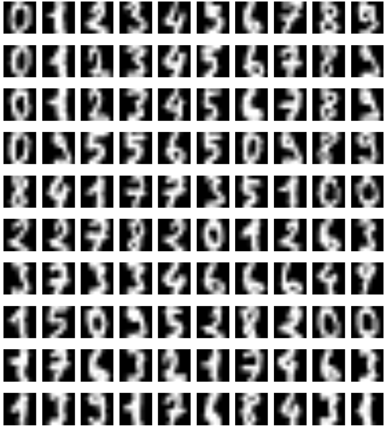

{"nbformat_minor": 0, "cells": [{"source": "We will be performing a PCA on the classic MNIST dataset of handwritten digits.", "cell_type": "markdown", "metadata": {}}, {"source": "### Explore the data", "cell_type": "markdown", "metadata": {}}, {"source": "Import the dataset and use `pylab` to explore.", "cell_type": "markdown", "metadata": {}}, {"source": "from sklearn.datasets import load_digits\ndigits = load_digits()\n\nimport pylab as pl\n%pylab inline\npl.gray();", "cell_type": "code", "execution_count": 1, "outputs": [{"output_type": "execute_result", "data": {"text/plain": "Populating the interactive namespace from numpy and matplotlib"}, "execution_count": 1, "metadata": {}}], "metadata": {"trusted": false}}, {"source": "    \nSee [load_digits documentation.](http://scikit-learn.org/stable/modules/generated/sklearn.datasets.load_digits.html)\n    \nUsing one figure with 100 subplots in 10-by-10 grid,  display the first 100 images using `pl.imshow`.", "cell_type": "markdown", "metadata": {}}, {"source": "", "cell_type": "markdown", "metadata": {}}, {"source": "    \nTo display only the images, use `pl.xticks([]), pl.yticks([])` and  `pl.axis('off')`.\n    \n#### PCA on subset", "cell_type": "markdown", "metadata": {}}, {"source": "For simplicity we will look at the first 6 digits.", "cell_type": "markdown", "metadata": {}}, {"source": "1- Load the first 6 digits of the MNIST digits dataset using [scikit-learn](http://scikit-learn.org/stable/modules/generated/sklearn.datasets.load_digits.html).", "cell_type": "markdown", "metadata": {}}, {"source": "2- For PCA, it is important that our data is normalized/scaled.  Using scikit-learn's [StandardScaler](http://scikit-learn.org/stable/modules/generated/sklearn.preprocessing.StandardScaler.html), scale the digits dataset.", "cell_type": "markdown", "metadata": {}}, {"source": "3- Now that we have properly scaled images, we can apply the PCA transformation.  Using scikit-learn's [PCA](http://scikit-learn.org/stable/modules/generated/sklearn.decomposition.PCA.html), project our digits dataset into lower dimensional space.  First try 10 components.", "cell_type": "markdown", "metadata": {}}, {"source": "4- Due to the loss of information in projecting data into lower dimensional space, our transformation is never perfect. One way we can determine how well it worked is to plot the amount of explained variance.  Using the function snippet below, plot the amount of explained variance of each of the principle components.", "cell_type": "markdown", "metadata": {}}, {"source": "def scree_plot(num_components, pca, title=None):\n    ind = np.arange(num_components)\n    vals = pca.explained_variance_ratio_\n    plt.figure(figsize=(10, 6), dpi=250)\n    ax = plt.subplot(111)\n    ax.bar(ind, vals, 0.35,\n           color=[(0.949, 0.718, 0.004),\n                  (0.898, 0.49, 0.016),\n                  (0.863, 0, 0.188),\n                  (0.694, 0, 0.345),\n                  (0.486, 0.216, 0.541),\n                  (0.204, 0.396, 0.667),\n                  (0.035, 0.635, 0.459),\n                  (0.486, 0.722, 0.329),\n                 ])\n\n    for i in xrange(num_components):\n            ax.annotate(r\"%s%%\" % ((str(vals[i]*100)[:4])), (ind[i]+0.2, vals[i]),\n                        va=\"bottom\", ha=\"center\", fontsize=12)\n    ax.set_xticklabels(ind, fontsize=12)\n\n    ax.set_ylim(0, max(vals)+0.05)\n    ax.set_xlim(0-0.45, 8+0.45)\n\n    ax.xaxis.set_tick_params(width=0)\n    ax.yaxis.set_tick_params(width=2, length=12)\n\n    ax.set_xlabel(\"Principal Component\", fontsize=12)\n    ax.set_ylabel(\"Variance Explained (%)\", fontsize=12)\n\n    if title is not None:\n        plt.title(title, fontsize=16)", "cell_type": "code", "execution_count": 2, "outputs": [], "metadata": {"trusted": false}}, {"source": "5- We need to pick an appropriate number of components to keep.  Looking at the plot of explained variance, we are interested in finding the least number of principle components that explain the most variance. What is the optimal number of components to keep for the digits dataset?\n    \nAnother way to visualize our digits is to force a projection into 2-dimensional space in order to visualize the data on a 2-dimensional plane. The code snippet below will plot our digits projected into 2-dimensions on x-y axis.", "cell_type": "markdown", "metadata": {}}, {"source": "# plot projection\n\ndef plot_embedding(X, y, title=None):\n    x_min, x_max = np.min(X, 0), np.max(X, 0)\n    X = (X - x_min) / (x_max - x_min)\n\n    plt.figure(figsize=(10, 6), dpi=250)\n    ax = plt.subplot(111)\n    ax.axis('off')\n    ax.patch.set_visible(False)\n    for i in range(X.shape[0]):\n        plt.text(X[i, 0], X[i, 1], str(y[i]), color=plt.cm.Set1(y[i] / 10.), fontdict={'weight': 'bold', 'size': 12})\n\n    plt.xticks([]), plt.yticks([])\n    plt.ylim([-0.1,1.1])\n    plt.xlim([-0.1,1.1])\n\n    if title is not None:\n        plt.title(title, fontsize=16)", "cell_type": "code", "execution_count": 3, "outputs": [], "metadata": {"trusted": false}}, {"source": "6- Using the above method, project the digits dataset into 2-dimensions.  Do you notice anything about the resulting projections?  Does the plot remind you of anything?  Looking at the results, which digits end up near each other in 2-dimensional space?  Which digits have overlap in this new feature space?", "cell_type": "markdown", "metadata": {}}], "nbformat": 4, "metadata": {}}