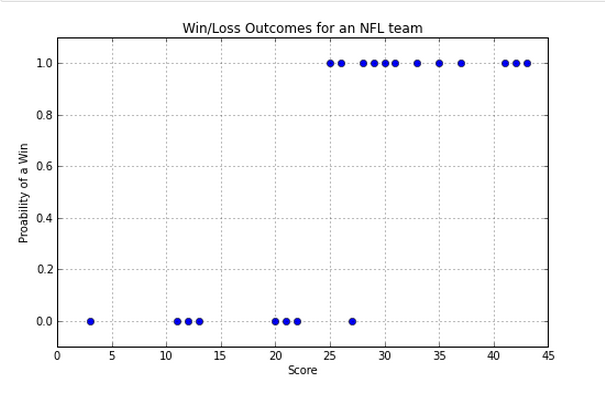
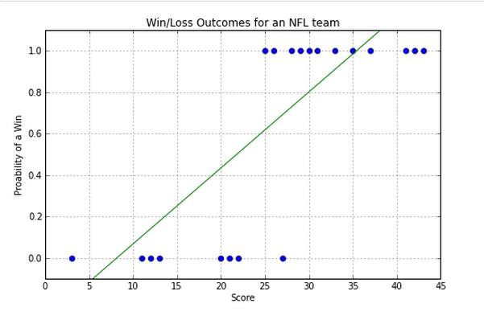

# Evaluation Metrics

The goal of this lab is to get comfortable with more advanced evaluation metrics and the intricacies of model performance/selection.

## Goals

* Name one situation when you would you use:
  * Arithmetic mean
  * Geometric mean
  * Harmonic mean
* Given two ROC curves, pick the best curve/threshold for the problem at hand
* When would you use F_beta vs. AUC
* State one reason why the Youden index is useful and one reason it can be misleading
* __Exercise (next week):__ Construct a Profit curve to evaluate the precision/recall trade-off

## Iteration Zero: Review (9:30 - 9:45)

A classification problem is when we're trying to predict a discrete (categorical) outcome. We'll start with binary classification (i.e., yes/no questions).

Here are some example questions:

* Does a patient have cancer?
* Will a team win the next game?
* Will the customer buy my product?
* Will I get the loan?

In binary classification, we assign labels of 0 and 1 to our data.

### Logistic Regression

Let's start by looking at an example. We're going to be using some NFL data. The x axis is the number of touchdowns scored by team over a season and the y axis is whether they lost or won the game indicated by a value of 0 or 1 respectively.



So, how do we predict whether we have a win or a loss if we are given a score? Note that we are going to be predicting values between 0 and 1. Close to 0 means we're sure it's in class 0, close to 1 means we're sure it's in class 1, and closer to 0.5 means we don't know.

If we use linear regression, we will certainly do better than randomly guessing, but it doesn't accurately represent the data:



So clearly a line is not the best way to model this data. So we need to find a better curve.

## Iteration 1: Measuring success (9:45 - 10:00)

So how do we measure how well our model does? Just like with regression, we need to split the data in a training set and a test set and measure our success based on how well it does on the test set.

### Accuracy
The simplest measure is **accuracy**. This is the number of correct predictions over the total number of predictions. It's the percent you predicted correctly. In `sklearn`, this is what the `score` method calculates.

### Shortcomings of Accuracy
Accuracy is often a good first glance measure, but it has many shortcomings. If the classes are unbalanced, accuracy will not measure how well you did at predicting. Say you are trying to predict whether or not an email is spam. Only 2% of emails are in fact spam emails. You could get 98% accuracy by always predicting not spam. This is a great accuracy but a horrible model!

### Confusion Matrix
We can get a better picture our model but looking at the confusion matrix. We get the following four metrics:

* **True Positives (TP)**: Correct positive predictions
* **False Positives (FP)**: Incorrect positive predictions (false alarm)
* **True Negatives (TN)**: Correct negative predictions
* **False Negatives (FN)**: Incorrect negative predictions (a miss)

|            | Predicted Yes  | Predicted No   |
| ---------- | -------------- | -------------- |
| Actual Yes | True positive  | False negative |
| Actual No  | False positive | True negative  |

With logistic regression, we can visualize it as follows:


### Precision, Recall and F1
Instead of accuracy, there are some other scores we can calculate:

* **Precision**: A measure of how good your positive predictions are
    ```
    Precison = TP / (TP + FP)
             = TP / (predicted yes)
    ```
* **Recall**: A measure of how well you predict positive cases. Aka *sensitivity*.
    ```
    Recall = TP / (TP + FN) 
           = TP / (actual yes)
    ```
* **F1 Score**: The harmonic mean of Precision and Recall
    ```
    F1 = 2 / (1/Precision + 1/Recall)
       = 2 * Precision * Recall / (Precision + Recall)
       = 2TP / (2TP + FN + FP)
    ```

Accuracy can also be written in this notation:
```
Accuracy = (TP + TN) / (TP + FP + TN + FN)
```

### Arithmetic vs. Geometric vs. Harmonic means


Just like there are many moments, there are many ways to compute a mean (scientists love generalization) and as such each has its own time and place.

#### Arithmetic

The arithmetic mean is the "average" we all have grown to know and love from elementary school and high school.

$$\displaystyle \bar{x} = \frac{1}{n}\sum_{i=1}^{n}x_{i}$$

When to use:

* Sum of values is significant (ex: grade in class computed from multiple grades on tests)
* Need a 'typical' value as an aggregate: minimizes sum squared deviations

#### Geometric Mean

The geometric mean is quite similar to the arithmetic mean but uses the product of values rather than sum.

$$\displaystyle GM = (\prod_{i=1}^{n}x_{i})^\frac{1}{n}$$

When to use:

* Product of values is significant (ex: year over year return on an investment)
*

__NOTE: The arithmetic mean is strictly larger than the geometric mean for non-negative real numbers.__

#### Harmonic Mean

The harmonic mean is by far encountered the least often (in usual applications) but when you do come across it however, it can be very useful.  The Harmonic mean is most often used when dealing with *ratios*.

$$H = \frac{n}{\sum_{i=1}^{n}\frac{1}{x_{i}}} $$

__It is the reciprocal of the arithmetic mean of the reciprocals...__

When to use:

* Dealing with ratios (ex: average of driving speeds)
* 
* When you need to compute the F1 score ;)

__NOTE: The Harmonic mean is strictly less than the geometric (arithmetic) mean for non-negative real numbers.__

### Example One: Students finishing a homework

You are tasked with figuring out the total completion time of two students to finish a homework assignment.  Stewart can finish this assignment in 4 hours and Mary can finish this assignment in 7 hours.

> How long in total will it take Stewart and Mary to finish the homework assignment if they work together (assuming perfect collaboration)?

## Iteration 1.1: K-fold Cross Validation

In K-fold cross validation, the data is split into **k** groups. One group
out of the k groups will be the test set, the rest (**k-1**) groups will
be the training set. In the next iteration, another group will be the test set,
and the rest will be the training set. The process repeats for k iterations (k-fold).
In each fold, a metric for accuracy (MSE in this case) will be calculated and
an overall average of that metric will be calculated over k-folds.

<div align="center">
    
</div>

<br>

Here we will implement K-fold validation **on the training dataset**.
`sklearn` has its own implementation of K-fold
(`sklearn.cross_validation_cross_val_score()`).
However, to ensure you have an understanding of K-fold, you will implement it
here.

<br>

1. To do this you need to manage randomly sampling **k** folds.

2. Properly combining those **k** folds into a test and training set on
   your **on the training dataset**. Outside of the k-fold, there should be
   another set which will be referred to as the **hold-out set**.

3. Train your model on your constructed training set and evaluate on the given test set

3. Repeat steps __2__ and __3__ _k_ times.

4. Average your results of your error metric.

5. Compare the MSE for your test set in Part 1. and your K-fold cross validated error in `4.`.

6. Plot a learning curve and test vs training error curve.
   (You might want to use: [cross_val_score](http://scikit-learn.org/stable/modules/generated/sklearn.cross_validation.cross_val_score.html) which is scikit-learn's built-in
   function for K-fold cross validation).  See [Illustration of Learning Curves](http://www.astro.washington.edu/users/vanderplas/Astr599/notebooks/18_IntermediateSklearn) for more details.

### Iteration 2: ROC Curves (10:00 - 10:15)

One of the best ways to evaluate how a classifier performs is an ROC curve. (http://en.wikipedia.org/wiki/Receiver_operating_characteristic)


To understand what is actually happening with an ROC curve, we can create one ourselves.  Here is pseudo code to plot it.

The `probabilities` are values in (0,1) returned from Logistic Regression. The standard default threshold is 0.5 where 0-0.5 values are interpreted as the negative class and 0.5-1 values are predicted as the positive class.

The `labels` are the true values.

```
function ROC_curve(probabilities, labels):
    Sort instances by their prediction strength (the probabilities)
    For every instance in increasing order of probability:
        Set the threshold to be the probability
        Set everything above the threshold to the positive class
        Calculate the True Positive Rate (aka sensitivity or recall)
        Calculate the False Positive Rate (1 - specificity)
    Return three lists: TPRs, FPRs, thresholds
```

Recall that the *true positive rate* is

```
 number of true positives     number correctly predicted positive
-------------------------- = -------------------------------------
 number of positive cases           number of positive cases
```

and the *false positive rate* is

```
 number of false positives     number incorrectly predicted positive
--------------------------- = ---------------------------------------
  number of negative cases           number of negative cases
```

We are going to be implementing the `roc_curve` function.

Here's some example code that you should be able to use to plot the ROC curve with your function. This uses a fake dataset.

```python

from sklearn.datasets import make_classification
from sklearn.linear_model import LogisticRegression
import matplotlib.pyplot as plt
from sklearn.cross_validation import train_test_split

X, y = make_classification(n_features=2, n_redundant=0, n_informative=2,
                           n_clusters_per_class=2, n_samples=1000)
X_train, X_test, y_train, y_test = train_test_split(X, y)

model = LogisticRegression()
model.fit(X_train, y_train)
probabilities = model.predict_proba(X_test)[:, 1]

tpr, fpr, thresholds = roc_curve(probabilities, y_test)

plt.plot(fpr, tpr)
plt.xlabel("False Positive Rate (1 - Specificity)")
plt.ylabel("True Positive Rate (Sensitivity, Recall)")
plt.title("ROC plot of fake data")
plt.show()
```

### Iteration Three: ROC Curve Implementation (10:15 - 10:30)

1. Write an ROC curve function to compute the above in `roc_curve.py`.

    It should take as input the predicted probabilities and the true labels.

2. Run the above code to verify that it's working correctly. You can also validate your correctness against [scikit-learns built-in function](http://scikit-learn.org/stable/modules/generated/sklearn.metrics.roc_curve.html).

3. Let's see how the roc curve looks on a real dataset. We're going to use the FICO Loan dataset. We want to predict whether or not you get approved for a loan of 12% interest rate given the FICO Score, Loan Length and Loan Amount. Here's the code to load the data:

    ```python
    import pandas as pd
    df = pd.read_csv('data/loanf.csv')
    y = (df['Interest.Rate'] <= 12).values
    X = df[['FICO.Score', 'Loan.Length', 'Loan.Amount']].values
    ```

    Make sure to split your data into training and testing using sklearn's [train_test_split()](http://scikit-learn.org/stable/modules/generated/sklearn.cross_validation.train_test_split.html).

### Iteration Four: Case Study -- Graduate School Admissions (10:30 - 11:00)

The data we will be using is the admission data on Grad school acceptances we saw before.

* `admit`: whether or not the applicant was admitted to grad. school
* `gpa`: undergraduate GPA
* `GRE`: score of GRE test
* `rank`: prestige of undergraduate school (1 is highest prestige, ala Harvard)

Remember, we will use the GPA, GRE, and rank of the applicants to try to predict whether or not they will be accepted into graduate school.

#### Prediction

Now we're ready to try to fit our data with Logistic Regression.

3. Use sklearn's [KFold cross validation](http://scikit-learn.org/stable/modules/generated/sklearn.cross_validation.KFold.html) and [LinearRegression](http://scikit-learn.org/stable/modules/generated/sklearn.linear_model.LogisticRegression.html) to calculate the average accuracy, precision and recall.

    Hint: Use sklearn's implementation of these scores in [sklearn.metrics](http://scikit-learn.org/stable/modules/classes.html#module-sklearn.metrics).

4. The `rank` column is numerical, but as it has 4 buckets, we could also consider it to be categorical. Use panda's [get_dummies](http://pandas.pydata.org/pandas-docs/stable/generated/pandas.core.reshape.get_dummies.html) to binarize the column.

5. Compute the same metrics as above. Does it do better or worse with the rank column binarized?

    From now on, use the version of the feature matrix that performed the best.

6. Make a plot of the ROC curve (using your function defined in Part 1).

7. Is it possible to pick a threshold where TPR > 60% and FPR < 40%? What is the threshold?

    *Note that even if it appears to be in the middle of the graph it doesn't make the threshold 0.5.*

8. Say we are using this as a first step in the application process. We want to weed out clearly unqualified candidates, but not reject too many candidates. What might be a good choice of threshold?

    There isn't a single correct answer, so explain your choice!

### Iteration Five: Youden Index (11:00 - 11:15)

Youden's Index (sometimes called J statistic) is similar to the F1 score in that it is a single number that describes the performance of a classifier.

$$J = Sensitivity + Specificity - 1$$

The J statistic ranges from 0 to 1:
* 0 indicating that the classifier does no better than random
* 1 indicating that the test performed perfectly

It can be thought of as an improvement on the F1 score since it takes into account all of the cells in a confusion matrix.  It can also be used to find the optimal threshold for a given ROC curve.
