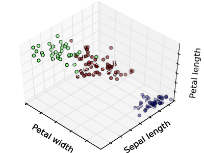

## K-means

### Setup

Now that you have so much experience computing bags from words, it should be a piece of cake to do it one more time in Python.  scikit-learn makes this a piece of cake, use their awesome functions: [CountVectorizer](http://scikit-learn.org/stable/modules/feature_extraction.html#common-vectorizer-usage) and [TfidfVectorizer](http://scikit-learn.org/stable/modules/generated/sklearn.feature_extraction.text.TfidfVectorizer.html) ([reference](http://scikit-learn.org/stable/modules/generated/sklearn.feature_extraction.text.CountVectorizer.html#sklearn.feature_extraction.text.CountVectorizer))

For the morning, we'll build the K-means algorithm from scratch, and test it on a classic dataset.

In the afternoon, we'll use K-means and hierarchical clustering to find patterns in text documents.  

### K-means

For this part of the exercise we will be using the famous [UCI Iris](http://archive.ics.uci.edu/ml/datasets/Iris) dataset.  Similar to the decision tree exercise, we will test our algorithm on a somewhat small (trivial) dataset to make sure the mechanics of our algorithm are functioning correctly before we apply it to a more substantial example.

#### The four steps to kmeans

1. Initialize your cluster centroids
2. Compute the distance between each point and every centroid
3. Assign each data point to the centroid closest to it
4. Move the cluster centroid to the center (mean) of all the points assigned to it
5. Repeat until convergence (or you get tired, i.e. hit a maximum number of iterations)

 (refresh/click to see animation)

#### Implementation

Now that you have some feeling of how things cluster, we will implement our  [kmeans](http://en.wikipedia.org/wiki/K-means_clustering) clustering.  We will now write a kmeans algorithm that takes as input a matrix of feature vectors, a k value, and a number of max iterations. 

__ASIDE: k-means usually only uses the Euclidean distance function (means, get it?)... but I like to break the rules sometimes and get crazy with other metrics (cosine).  This usually isn't done and technically isn't algorithmically sound, but if it gets results...__

We will leave many design decisions up to you, but be sure to write clean, well encapsulated code.  I would suggest either an object oriented approach using a `Kmeans` class or a functional approach where you pass a dataset to a function which runs the iteration for you and spits out the relevant centroids and assignments when you algorithm has finished.

2. Load the dataset with `scikit-learn`, but since we will be hand coding our Kmeans in `numpy` we only need to get the features into an array.  Create a numpy array of the features of the iris dataset.  Do not use the labels for the clustering.

3. Using Numpy, initialize your cluster centers by selecting random data points.  We will try our algorithm with multiple different `k` but let us start with 10.  Pick at random 10 of our initial points.  May I suggest: [http://docs.python.org/2/library/random.html#random.sample](http://docs.python.org/2/library/random.html#random.sample)

4. For every one of your data points and compute the Euclidean distance between it and every centroid. Assign the point to the closest centroid.

5. Move the centroids to the center (mean of distances) of their cluster.

6. Iterate (#4 and #5).  If no clusters changed (i.e. no new points assigned to them) you have converged.  Exit.  Exit now!   

 Often it is tough to pick an ideal k in advance.  We can force k in our case if we want a predetermined number of sections/topics.  But it is most likely better to let the algorithm tell us what k it wants.  We can do this using the [elbow method](http://en.wikipedia.org/wiki/Determining_the_number_of_clusters_in_a_data_set).

7. Run the algorithm with varying numbers of k.  For each, compute the sum of squared error ([SSE](http://en.wikipedia.org/wiki/Residual_sum_of_squares)).  This is the distance of each point to its final centroid, squared, and summed over all datas points.  Plot this for each value of k and try to find an elbow. [Determining the number of clusters](http://en.wikipedia.org/wiki/Determining_the_number_of_clusters_in_a_data_set).  Is there an optimal # of K?

8. Another meric to assess how well your data has been clustered is the Silhouette coefficient.  Using `scikit-learn's` metric package compute the [silhouette coefficient](http://scikit-learn.org/stable/modules/clustering.html#silhouette-coefficient) of the clusteres produced by your own Kmeans implementation on the iris data.

9. Visualize the centroid assigments.  Create a plot of the cluster assignments on the iris data.  Each data point should be colored according to its assignment.  First make a 2-d plot of each pair of features for the iris dataset.  If you are feeling fancy make a 3-d plot.

 

8. Compare your cluster results with [scikit-learn Kmeans](http://scikit-learn.org/stable/tutorial/statistical_inference/unsupervised_learning.html#k-means-clustering).  Since K-means is a stochastic algorithm (random initialization) your result will be slightly (but hopefully not too) different.

### Extra Credit

The standard k-means as some failings.  [kmeans++](http://en.wikipedia.org/wiki/K-means++) ([visualized](http://shabal.in/visuals/kmeans/KMeansPlusPlus.pdf)) solves the issue of picking the initial cluster centroids. 

#### Variants

 2. Implement the kmeans++ initializtion in your algorithm.
 3. Another variation on k-means is [bi-secting kmeans](http://stackoverflow.com/questions/6871489/bisecting-k-means-clustering-algorithm-explanation).  Adapt your code to implement bisecting kmeans.

#### Animation

`matplotlib` actually has a decent animation package that can visualize a sequence of plots.

 1. Visualize the convergence of your algorithm on the iris dataset.  Using `matplotlibs` animation [framework](https://jakevdp.github.io/blog/2012/08/18/matplotlib-animation-tutorial/), visualize the cluster assignments at each step of the iteration.  To keep things simple choose 2 features to visualize, if you are feeling fancy you can make a 3-d plot that is animated.
